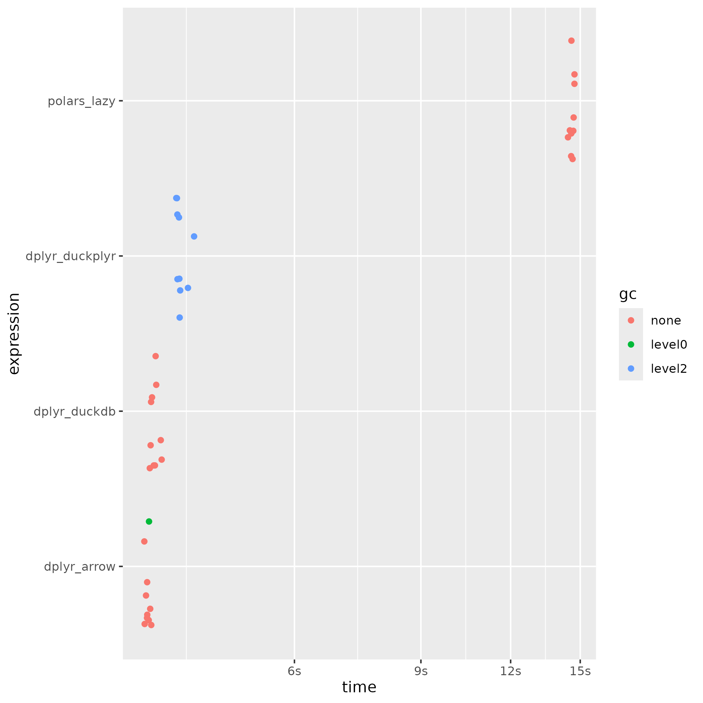

# taxi-trip-records

Comparing multiple approaches for analysing bigger than memory data in one computer.

Here I used the [New York Taxi and Limousine Commission data](https://www.nyc.gov/site/tlc/about/tlc-trip-record-data.page) from 2022 and 2023.

You can execute the run.R file to generate the plot with the results of the benchmark. Here my results:

